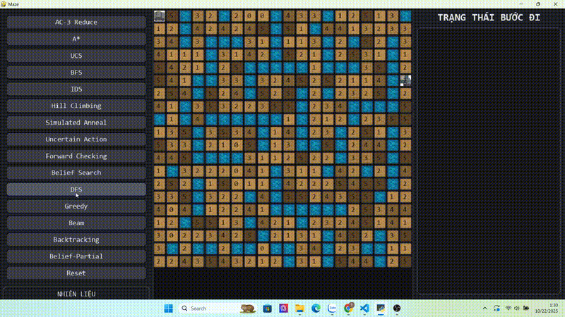
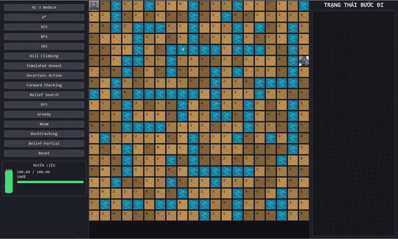
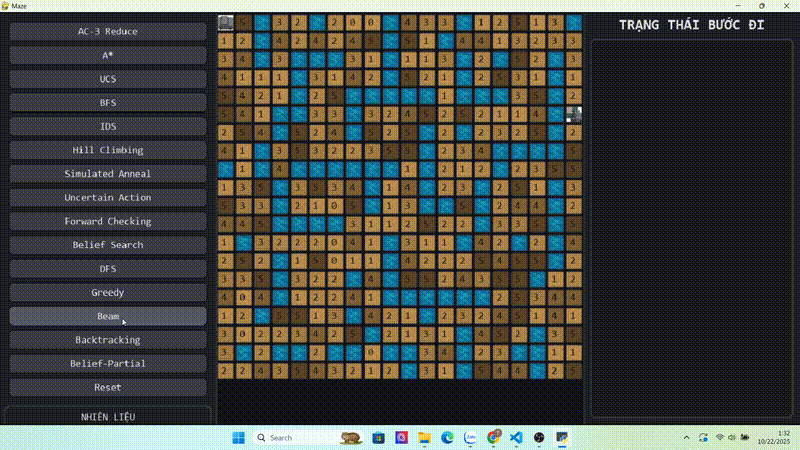
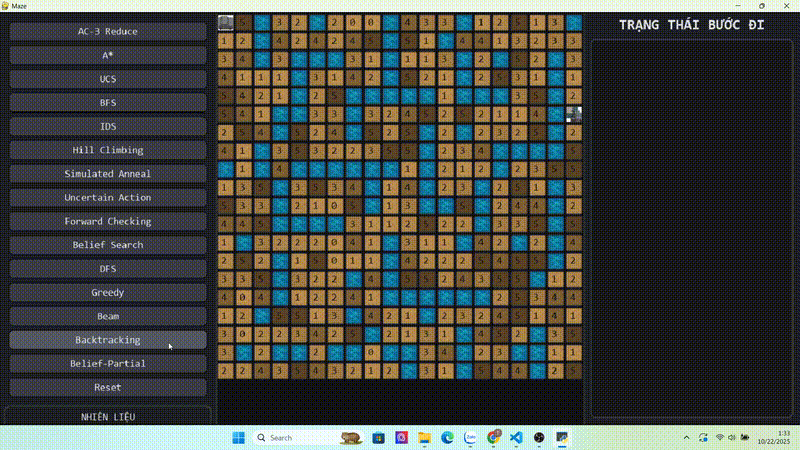

# BÀI TẬP LỚN NHÓM 4 MÔN TRÍ TUỆ NHÂN TẠO
## Maze Game - 15 Thuật toán AI

> ** Trải nghiệm game Maze với 15 thuật toán AI tiên tiến!**

**Nhóm thực hiện:**  
- **Phạm Minh Khánh** - MSSV: 23110114 
- **Phạm Đăng Quang** - MSSV: 23110143  
- **Trần Đức Trường** - MSSV: 23110164  

**Lớp:** 251ARIN330585_04CLC  
**Môn học:** Trí tuệ nhân tạo  
**Giảng viên:** Phan Thị Huyền Trang  

---

## THÔNG TIN BÀI TẬP

### Yêu cầu đề bài:
Triển khai game Maze với AI sử dụng 15 thuật toán AI khác nhau bao gồm:
- **Tìm kiếm không có thông tin**: BFS, DFS, UCS, IDS
- **Tìm kiếm có thông tin**: Greedy, A*
- **Tìm kiếm cục bộ**: Hill Climbing, Simulated Annealing, Beam Search
- **Tìm kiếm niềm tin**: Belief-Conformant Search, Belief-Partial Search
- **Tìm kiếm CSP**: Backtracking, Forward Checking, AC-3
- **Tìm kiếm planning**: AND-OR Planning

### Mục tiêu game:
Maze Game phải di chuyển trong mê cung địa hình có độ cao thay đổi, với mục tiêu là tìm đường đến đích (Goal) trong khi:
- Tối ưu hóa lượng nhiên liệu sử dụng — mỗi bước di chuyển tiêu hao nhiên liệu tùy theo độ dốc giữa hai ô.
- Tránh các ô hố (X) hoặc địa hình quá dốc vượt quá giới hạn di chuyển.
- Tự động tìm đường bằng các thuật toán trí tuệ nhân tạo (AI) khác nhau để so sánh hiệu quả giữa các hướng tiếp cận.
- Đánh giá hiệu quả thuật toán qua các tiêu chí: độ dài đường đi, lượng nhiên liệu tiêu hao, và khả năng đạt đích.


## HƯỚNG DẪN CHẠY CHƯƠNG TRÌNH

### Bước 1: Kiểm tra yêu cầu hệ thống
```bash
# Kiểm tra Python (cần Python 3.8+)
python --version

# Kiểm tra pip
pip --version
```

### Bước 2: Cài đặt thư viện cần thiết
```bash
# Cài đặt Pygame cho game engine
pip install pygame

# Nếu gặp lỗi, thử:
pip install pygame --upgrade
```

##  CÁCH CHƠI VÀ ĐIỀU KHIỂN

### Khởi động:
- **Khi chạy game**: nhập số xăng ban đầu (ví dụ 80 hoặc 75.5) rồi nhấn Enter để bắt đầu.

### Điều khiển cơ bản:
- **ESC**: Thoát game
- **R*: Reset về điểm Start và khôi phục lượng xăng ban đầu
- **↑ ↓ ← → hoặc W A S D**: Di chuyển thủ công từng bước (nếu muốn thử tay)

### Chạy tự động bằng thuật toán: 
- Ở panel bên trái, bấm vào nút thuật toán để game tự tìm đường và chạy theo đường đó:


##  15 THUẬT TOÁN AI ĐÃ TRIỂN KHAI

###  TÌM KIẾM KHÔNG CÓ THÔNG TIN

| STT | Thuật toán | Mô tả & Ưu điểm | Demo |
|-----|------------|-----------------|------|
| 1 | **BFS** - Breadth-First Search | Tìm đường đi ngắn nhất |  |
| 2 | **DFS** - Depth-First Search | Khám phá sâu, tiết kiệm bộ nhớ |  |
| 3 | **IDS** - Iterative Deepening Search | Kết hợp ưu điểm BFS & DFS |  |

###  TÌM KIẾM CÓ THÔNG TIN

| STT | Thuật toán | Mô tả & Ưu điểm | Demo |
|-----|------------|-----------------|------|
| 4 | **UCS** - Uniform Cost Search | Tối ưu chi phí đường đi |  |
| 5 | **Greedy** - Greedy Best-First | Nhanh nhưng không tối ưu |  |
| 6 | **A*** - A-star Search | Tối ưu và hiệu quả nhất |  |

###  TÌM KIẾM CỤC BỘ

| STT | Thuật toán | Mô tả & Ưu điểm | Demo |
|-----|------------|-----------------|------|
| 7 | **Hill Climbing** | Leo đồi - đơn giản nhưng có thể bị kẹt |  |
| 8 | **Simulated Annealing** | Luyện kim mô phỏng - thoát cực trị |  |
| 9 | **Beam Search** | Tìm kiếm chùm - cân bằng tốc độ/chất lượng |  |


###  TÌM KIẾM NIỀM TIN

| STT | Thuật toán | Mô tả & Ưu điểm | Demo |
|-----|------------|-----------------|------|
| 10 | **Belief Search** | Tìm kiếm trên tập niềm tin |  |
| 11 | **Belief-Partial** | Tìm kiếm trên tập niềm tin xác định một phần |  |

###  TÌM KIẾM CSP (Constraint Satisfaction)

| STT | Thuật toán | Mô tả & Ưu điểm | Demo |
|-----|------------|-----------------|------|
| 12 | **Backtracking** | Quay lui - giải ràng buộc cơ bản |  |
| 13 | **Forward Checking** | Kiểm tra tiến - CSP hiệu quả |  |
| 14 | **AC-3** - Arc Consistency | Giảm miền giá trị, tăng hiệu quả |  |

###  TÌM KIẾM PLANNING

| STT | Thuật toán | Mô tả & Ưu điểm | Demo |
|-----|------------|-----------------|------|
| 15 | **AND-OR Planning** | Lập kế hoạch có điều kiện |  |

---

## 🎯 CÁCH ĐÁNH GIÁ VÀ KIỂM TRA

### Test cơ bản:
1. **Chạy game**: `python GameMaze.py` - Nhập xăng ban đầu → kiểm tra panel trái (nút + fuel), mê cung giữa, log phải.
2. **Thuật toán**: Bấm nút ở panel trái (A*, UCS, BFS, …) → xe tự chạy nếu đủ xăng.
3. **Điều khiển tay**: W/A/S/D hoặc ↑/↓/←/→ (thử từng bước).
4. **Reset**: R để về S và khôi phục xăng.

### Test chi tiết từng thuật toán:
1. **A* / UCS / Greedy / Beam**: so chi phí (xăng tiêu hao), độ dài đường, thời gian.
2. **BFS / DFS**: đối chiếu hành vi trên bản đồ có trọng số (không tối ưu chi phí).
3. **Hill / SA**: kiểm tra kẹt cục bộ (Hill) vs khả năng thoát kẹt (SA).
4. **Forward Checking**: loại sớm nhánh “chết” khi dốc/xăng gắt.
5. **AND–OR (Uncertain)**: so hành động dự định vs kết quả thực trong log.
6. **Belief (Conformant) / Belief-Partial**: so tốc độ vs mức bảo đảm (toàn bộ trạng thái).
### Metrics đánh giá:
- **Thành công**: đến G (✔/✖).
- **Tổng chi phí/xăng tiêu hao**: (càng thấp càng tốt).
- **Độ dài đường đi**: số ô

---


##  TÍNH NĂNG NỔI BẬT

###  Giao diện game:
- **Graphics**: Lưới mê cung auto-fit màn hình, tile theo độ cao h0–h5, hố X (nước), đích G
- **Animation**: Xe đổi hướng theo sprite car_up / car_right / car_down / car_left, chấm visited hiển thị lộ trình
- **Particle Effects**: ô hiện tại, viền ô, hiệu ứng cảnh báo khi xăng thấp
- **UI**: Thanh trái nút thuật toán, thanh phải log realtime, đồng hồ nhiên liệu dạng cột

###  AI System:
- **15 thuật toán**: Hoàn chỉnh từ cơ bản đến nâng cao
- **Comparison mode**: So sánh hiệu quả các thuật toán

###  Analytics:
- **Log realtime**: Mỗi bước ghi chi phí xăng, vị trí, trạng thái (thành công/thất bại)
- **Algorithm stats**: Độ dài path tìm được, khả thi theo fuel_budget
- **Level progression**: So sánh bằng số bước di chuyển và tổng xăng tiêu hao hiển thị trực tiếp

---

---

##  LIÊN HỆ HỖ TRỢ

Nếu gặp vấn đề khi chạy code hoặc cần giải thích thêm về thuật toán:
- **Email nhóm**: [23110143@student.hcmute.edu.vn]

**Cảm ơn cô đã xem xét bài tập! **


*Bài tập này được thực hiện với mục đích học tập và nghiên cứu.*

** CHÚC CÔ CHẤM BÀI VUI VẺ VÀ TRẢI NGHIỆM GAME THÚ VỊ! **
